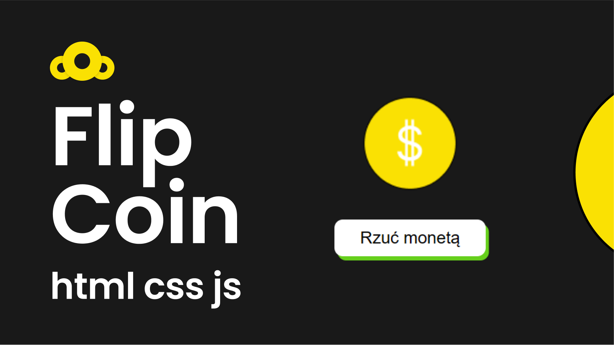

 
<h1 align="center">Flip Coin</h1>
  

&#xa0;

<a target="_blank" href="https://SimpleAsCode.github.io/flip-coin/">Demo</a>

  

  

  

  

  <a href="#dart-about">About</a> &#xa0; | &#xa0; 
  <!-- <a href="#sparkles-features">Features</a> &#xa0; | &#xa0; -->
  <a href="#rocket-technologies">Technologies</a> &#xa0; | &#xa0;
  <a href="#white_check_mark-requirements">Requirements</a> &#xa0; | &#xa0;
  <a href="#checkered_flag-starting">Starting</a> &#xa0; | &#xa0;
  <a href="https://github.com/SimpleAsCode" target="_blank">Author</a>

 

## :dart: About
Its a simple app showing how js works. We simulate a coin flip.

## :rocket: Technologies

The following tools were used in this project:

- HTML
- CSS
- JS

## :white_check_mark: Requirements

You just need a browser.
https://SimpleAsCode.github.io/flip-coin/

## :checkered_flag: Starting

download the project and start **index.html**

## 😎 Made by

Made with ❤️ by <a href="https://github.com/SeveToo" target="_blank">SeveTo</a>
